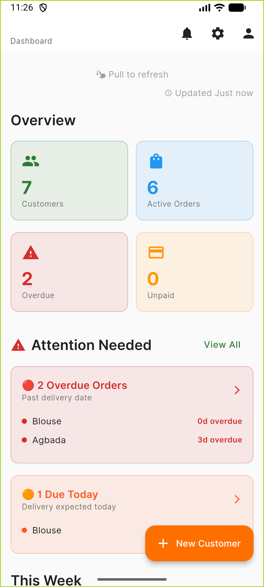
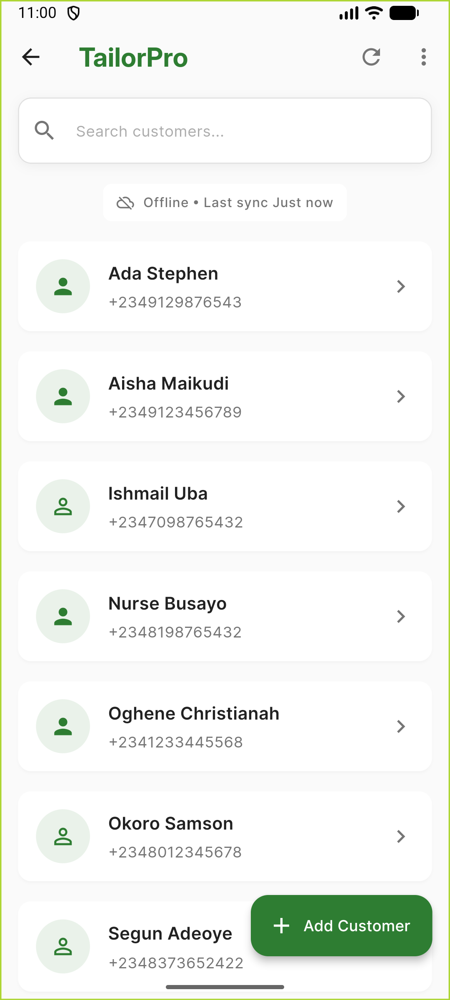
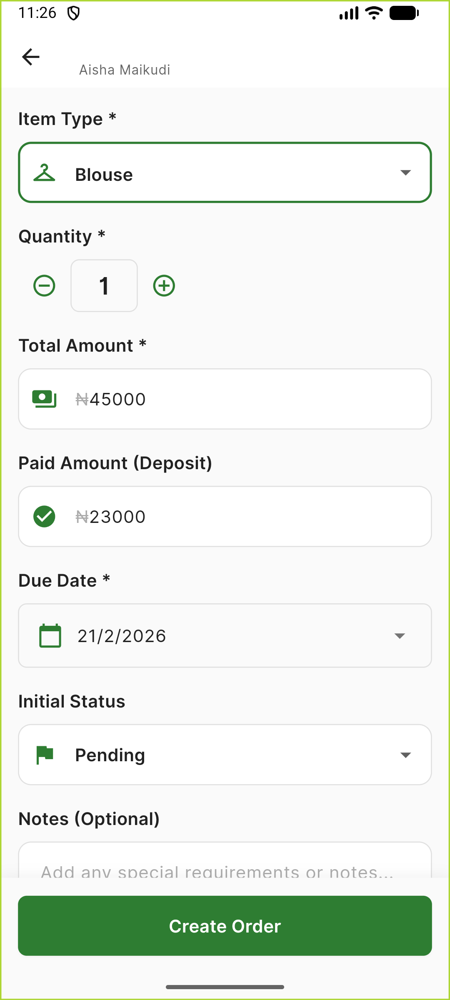
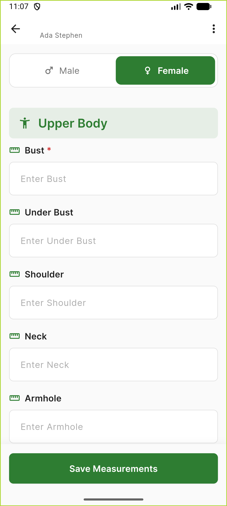
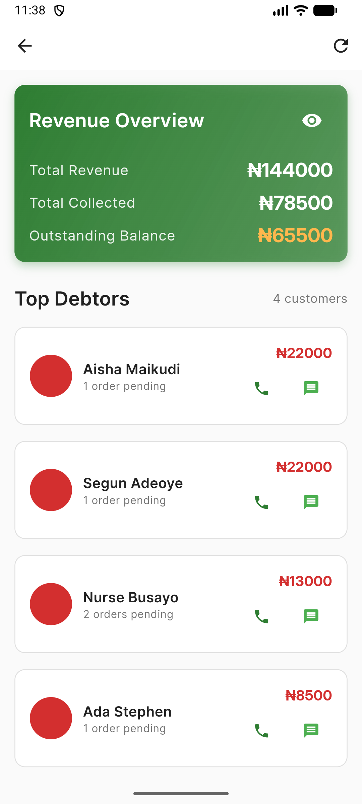
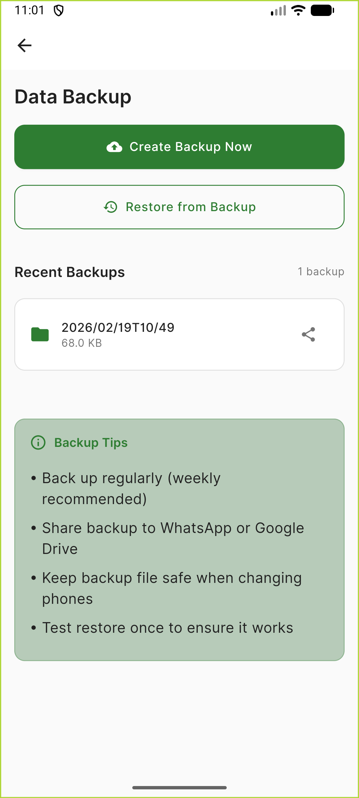

# TailorPro 🪡

**c**

A complete offline-first mobile solution for tailors to efficiently manage customers, measurements, orders, and payments.

Built with Flutter for Android.

---

## 📱 Screenshots

<p align="center">
  
  
  
  
</p>

<p align="center">
  
  
  
</p>
---

## ✨ Features

### 👥 Customer Management
- Store unlimited customer contacts
- Quick call & WhatsApp integration  
- Track complete customer history
- Search and filter functionality

### 📏 Measurements Tracking
- Detailed body measurements storage
- Male/Female garment templates
- Copy from previous measurements
- Multiple garment types (Shirts, Trousers, Native wear, etc.)

### 📦 Order Management
- Create orders with delivery dates
- Track order status (Pending → In Progress → Ready → Collected)
- Visual progress indicators
- Overdue order alerts
- Payment tracking per order

### 💰 Payment & Financial Features
- Record cash and bank transfer payments
- Automatic balance calculation
- Payment history per customer
- Financial summary dashboard
- Privacy-protected revenue display
- Top debtors list with contact options
- Overdue payment tracking

### 💾 Data Backup & Restore
- Export entire database to file
- Share backups via WhatsApp/Email/Drive
- Import backup on new device
- Automatic cleanup of old backups
- Complete data portability

### 📊 Business Dashboard
- Quick statistics overview
- Attention cards for urgent orders
- Weekly delivery schedule
- Payment status summary
- Real-time data updates

### 🔒 Privacy & Security
- 100% offline functionality
- No internet required to operate
- Data stored locally on device
- No cloud services or tracking
- User has complete control

---

## 🛠️ Tech Stack

- **Framework:** Flutter 3.4+
- **Language:** Dart
- **Database:** SQLite (sqflite package)
- **Architecture:** Offline-first, Repository pattern
- **Design:** Material Design 3
- **Platform:** Android (API 21 - 36)
- **State Management:** StatefulWidget

### Key Dependencies
- `sqflite` - Local database
- `path_provider` - File system access
- `url_launcher` - Phone/WhatsApp integration
- `share_plus` - Backup sharing
- `file_picker` - Backup import
- `sizer` - Responsive UI

---

## 📋 Prerequisites

- Flutter SDK (^3.4.3)
- Dart SDK
- Android Studio / VS Code with Flutter extensions
- Android SDK (API 21 or higher)

---

## 🛠️ Installation

### For Users (Tailors)

**Option 1:** Download from Google Play Store *(coming soon)*

**Option 2:** Download APK directly
1. Go to [Releases](../../releases)
2. Download `tailorpro-v1.0.0.apk`
3. Install on your Android device
4. Enable "Install from Unknown Sources" if prompted

### For Developers

1. **Clone the repository:**
```bash
git clone https://github.com/peterduro2000-star/tailorpro.git
cd tailorpro
```

2. **Install dependencies:**
```bash
flutter pub get
```

3. **Run the application:**
```bash
flutter run
```

---

## 📁 Project Structure
```
tailorpro/
├── lib/
│   ├── core/              # App-wide configurations
│   │   └── app_export.dart
│   ├── models/            # Data models
│   │   ├── customer_model.dart
│   │   ├── measurement_model.dart
│   │   ├── order_model.dart
│   │   └── payment_model.dart
│   ├── repositories/      # Database operations
│   │   ├── customer_repository.dart
│   │   ├── order_repository.dart
│   │   ├── payment_repository.dart
│   │   └── backup_repository.dart
│   ├── services/          # Core services
│   │   └── database_helper.dart
│   ├── presentation/      # UI screens
│   │   ├── dashboard/
│   │   ├── customer_list/
│   │   ├── customer_profile/
│   │   ├── measurements/
│   │   ├── create_order/
│   │   ├── financial_summary/
│   │   └── settings/
│   ├── widgets/           # Reusable components
│   ├── routes/            # Navigation
│   └── theme/             # App theming
├── assets/
│   ├── fonts/             # Local fonts (Inter)
│   ├── icon/              # App icon
│   └── images/            # Static images
├── android/               # Android configuration
├── screenshots/           # App screenshots
└── README.md
```

---

## 🎯 Target Users

- **Primary:** Individual tailors and small tailoring businesses
- **Secondary:** Fashion designers, alteration services
- **Location:** Primarily Nigeria and West Africa
- **Use Case:** Offline business management without internet dependency

---

## 🚀 Building from Source

### Debug Build
```bash
flutter build apk --debug
```

### Release Build (for distribution)
```bash
# Single APK (universal)
flutter build apk --release

# Split APKs by architecture (smaller file size)
flutter build apk --release --split-per-abi

# App Bundle (for Play Store)
flutter build appbundle --release
```

Built files location:
- APK: `build/app/outputs/flutter-apk/`
- Bundle: `build/app/outputs/bundle/release/`

---

## 🎨 Theming

The app uses a custom theme with local Inter font family:
```dart
// Accessing theme
ThemeData theme = Theme.of(context);

// Using theme colors
Color primaryColor = theme.colorScheme.primary; // Deep green
Color accentColor = theme.colorScheme.secondary; // Warm brown
```

**Color Palette:**
- Primary: Deep Green (#2E7D32) - Trust and professionalism
- Secondary: Warm Brown (#8D6E63) - Fabric association
- Accent: Orange (#FF6F00) - Call-to-action

---

## 📱 Responsive Design

Built with Sizer package for cross-device compatibility:
```dart
// Responsive sizing examples
Container(
  width: 90.w,  // 90% of screen width
  height: 20.h, // 20% of screen height
  padding: EdgeInsets.all(4.w), // 4% of width
)
```

---

## 🗄️ Database Schema

### Tables
- **customers** - Customer information
- **measurements** - Body measurements per customer
- **orders** - Order details and status
- **payments** - Payment records linked to orders

### Relationships
- One customer → Many measurements
- One customer → Many orders
- One order → Many payments

---

## 🤝 Contributing

Contributions are welcome! Here's how:

1. **Fork** the repository
2. **Create** a feature branch
```bash
   git checkout -b feature/AmazingFeature
```
3. **Commit** your changes
```bash
   git commit -m 'Add some AmazingFeature'
```
4. **Push** to the branch
```bash
   git push origin feature/AmazingFeature
```
5. **Open** a Pull Request

### Contribution Ideas
- [ ] Add photo upload for customers
- [ ] Implement cloud backup (Google Drive)
- [ ] Add PDF receipt generation
- [ ] Create automated WhatsApp reminders
- [ ] Add multi-language support
- [ ] Implement dark mode
- [ ] Add tablet optimization

---

## 📜 License

This project is licensed under the MIT License - see the [LICENSE](LICENSE) file for details.

---

## 👨‍💻 Developer

**[Peter Duro]**
- GitHub: [@peterduro2000](https://github.com/peterduro2000)
- Email: pwterduro2000@gmail.com
- LinkedIn: [Your Profile](https://linkedin.com/in/yourprofile)

---

## 🙏 Acknowledgments

- Built with [Flutter](https://flutter.dev) & [Dart](https://dart.dev)
- Icons from Material Design
- Inspired by real tailors' needs in Nigeria
- Special thanks to all beta testers

---

## 📝 Changelog

### Version 1.0.0 (February 2026)
#### Initial Release
- ✅ Customer management system
- ✅ Measurements tracking
- ✅ Order management with status tracking
- ✅ Payment recording and history
- ✅ Financial summary dashboard
- ✅ Backup and restore functionality
- ✅ Offline-first architecture
- ✅ Material Design 3 UI
- ✅ Call & WhatsApp integration

---

## 🐛 Known Issues

None at this time. Please report issues via [GitHub Issues](../../issues).

---

## 🗺️ Roadmap

### Version 1.1 (Planned)
- [ ] Photo uploads (customer photos, fabric samples)
- [ ] Cloud sync with Google Drive
- [ ] PDF receipt generation
- [ ] Export reports to Excel

### Version 1.2 (Future)
- [ ] Auto WhatsApp payment reminders
- [ ] Multi-user support (for shops)
- [ ] Dark mode
- [ ] Tablet optimization
- [ ] Multi-language (Yoruba, Igbo, Hausa)

---

## 💬 Support

Found this helpful? Please:
- ⭐ **Star** this repository
- 🐛 **Report bugs** via Issues
- 💡 **Suggest features**
- 🔀 **Fork and contribute**
- 📢 **Share** with other tailors

---

## 📊 Stats


---

**Made with ❤️ for tailors everywhere**

*Empowering tailors to manage their business efficiently, one stitch at a time.*